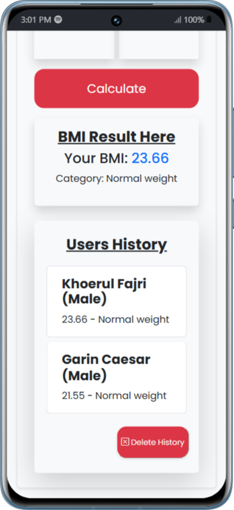

# BMI Calculator

## 📌 Overview

BMI Calculator adalah aplikasi berbasis web yang memungkinkan pengguna menghitung Indeks Massa Tubuh (BMI) berdasarkan berat badan dan tinggi badan yang dimasukkan. Proyek ini dibuat menggunakan **React** dengan **Vite** untuk performa yang lebih cepat.

## 🚀 Features

- Menghitung BMI berdasarkan berat dan tinggi badan pengguna
- Menampilkan kategori BMI (Underweight, Normal, Overweight, Obese)
- UI responsif dengan Bootstrap dan TailwindCSS
- Validasi input untuk memastikan nilai yang dimasukkan sesuai

## 🛠️ Tech Stack

- **Frontend**: React, Vite
- **Styling**: Bootstrap, TailwindCSS
- **State Management**: useState Hook

## 📦 Installation & Setup

1. Clone repository ini:
   ```bash
   git clone https://git.enigmacamp.com/enigma-camp/oflline-class-lovelace/lovelace-turing-19/garin-caesar-syanugiri/fe/challenge/react-bmi.git
   ```
2. Masuk ke direktori proyek:
   ```bash
   cd bmi-calculator
   ```
3. Install dependencies:
   ```bash
   npm install
   ```
4. Jalankan proyek di mode development:
   ```bash
   npm run dev
   ```
5. Buka browser dan akses:
   ```
   http://localhost:8081
   ```

## 🔧 Build

Untuk membuat versi production:

```bash
npm run build
```

Output akan disimpan di folder `dist/`, siap untuk deployment.

## 📸 Preview




## 📜 License

Proyek ini dirilis di bawah lisensi MIT. Silakan gunakan dan modifikasi sesuai kebutuhan.

---

✨ Dibuat dengan ❤️ oleh [Garin Caesar](https://github.com/garincsr) ✨
